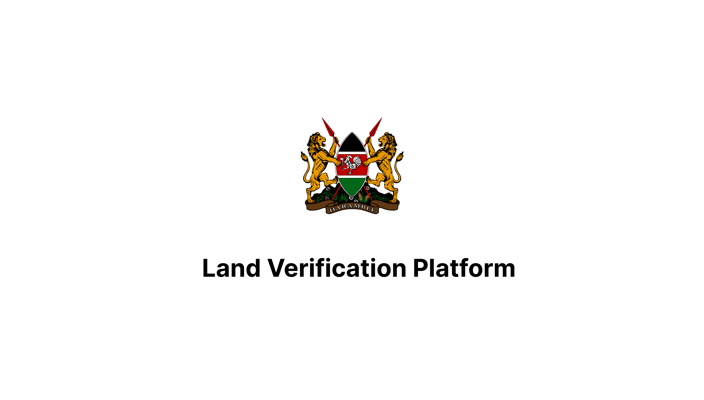

<p align="center"></p>

## About
This repository contains the code for the client-side of the land verification platform, a web application that allows users to interact with the platform's blockchain network to add and verify land transactions.

## Technologies Used
1. `Next.js` building the user interface
2. `firebase` authentication and user data synching


## Getting Started
To get started with this project, clone the repository and install the dependencies:

```
$ git clone https://github.com/WalterBanda/Land-Verification-Client.git

$ cd land-verification-platform-client

$ npm install
```

Then, start the development server:

```
$ npm start
```

The application will be available at http://localhost:3000.

## Deployment
To deploy the client, build the production version of the application and deploy the resulting files to a web server:

```
$ npm run build
```

## License
This project is licensed under the MIT License - see the LICENSE file for details.